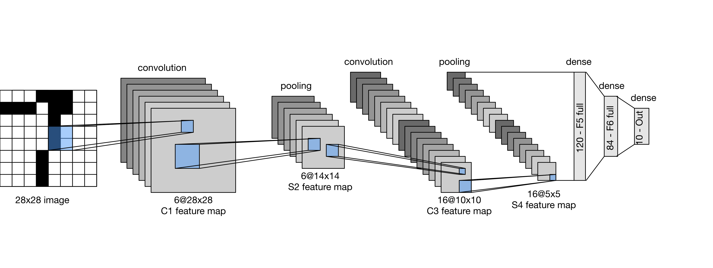

# 1. Deep Learning for Defect Classification

In this session, we'll apply deep learning to real-world steel defect detection problems, building a CNN from scratch to classify steel surface defects.

```{rubric} Learning Outcomes
```

By the end of this day, you will be able to:

- **Understand** the fundamentals of deep neural networks 
- **Build and train** neural networks using TensorFlow/Keras
- **Apply** deep learning to ...
- **Evaluate** model performance and avoid common pitfalls

:::{questions}
- How do I prepare image data for deep learning?
- What are convolutional neural networks and how do they work?
- How can I build and train a CNN model for image classification?
- How can I evaluate and improve model performance?
:::

:::{objectives}
- Load and preprocess image datasets using TensorFlow/Keras
- Understand CNN architecture and convolution operations
- Build a LeNet model for image classification
- Apply data augmentation to improve model robustness
- Train, evaluate, and visualize model performance
- Apply transfer learning for materials property prediction
:::

:::{highlight} python
:::

## 1.1. Formulate / Outline the Problem

We aim to build a deep learning model to classify steel surface defects. The goal is to automatically detect six types of surface defects in manufacturing quality control using convolutional neural networks (CNNs).

## 1.2. Identify Inputs and Outputs

**Inputs**
- **Images**: Steel surface images of size 255×255 pixels, RGB color channels
- **Labels**: Six categorical classes representing defect types:
  - **Crazing**: Fine surface cracks
  - **Inclusion**: Foreign particles embedded in steel
  - **Patches**: Surface irregularities and patches
  - **Pitted**: Pit-like deformations
  - **Rolled**: Surface scratches from rolling
  - **Scratches**: Deep scratch marks

**Outputs**
- **Predictions**: Probability distribution across 6 defect classes (softmax output)
- **Classification**: Predicted defect class for each input image

## 1.3. Prepare Data

**Dataset Overview**

We will work with the **NEU Surface Defect Database**, containing images of six types of steel surface defects. This is a practical application used in manufacturing quality control to automatically detect defects.

**Option 1: Download from Kaggle (Recommended)**

```python
import kagglehub
path = kagglehub.dataset_download("kaustubhdikshit/neu-surface-defect-database")
print("Path to dataset files:", path)
```

**Option 2: Manual Download**

1. Download from [Kaggle](https://www.kaggle.com/datasets/kaustubhdikshit/neu-surface-defect-database)
2. Extract to a `data` folder in your workspace

Expected directory structure:
```
data/
├── NEU-DET/
    ├── train/images/
    │   ├── crazing/
    │   ├── inclusion/
    │   ├── patches/
    │   ├── pitted/
    │   ├── rolled/
    │   └── scratches/
    └── validation/images/
        ├── crazing/
        ├── inclusion/
        ├── patches/
        ├── pitted/
        ├── rolled/
        └── scratches/
```

**Load and Explore the Dataset**

```python
import tensorflow as tf
import os

BATCH_SIZE = 32
IMAGE_SIZE = 255

train_path_img = "path/to/train/images"
validation_path_img = "path/to/validation/images"

# Get class names sorted for consistency
class_names = sorted(os.listdir(train_path_img))

# Load training dataset
train_dataset = tf.keras.preprocessing.image_dataset_from_directory(
    directory=train_path_img,
    labels='inferred',
    label_mode='categorical',
    batch_size=BATCH_SIZE,
    image_size=(IMAGE_SIZE, IMAGE_SIZE),
    class_names=class_names,
    shuffle=True,
    seed=100
)

# Load validation dataset
val_dataset = tf.keras.preprocessing.image_dataset_from_directory(
    directory=validation_path_img,
    labels='inferred',
    label_mode='categorical',
    batch_size=BATCH_SIZE,
    image_size=(IMAGE_SIZE, IMAGE_SIZE),
    class_names=class_names,
    shuffle=False,
    seed=100
)
```

**Visualize Sample Images**

```python
import matplotlib.pyplot as plt
import numpy as np

plt.figure(figsize=(15, 10))
for images, labels in train_dataset.take(1):
    for i in range(min(15, len(images))):
        ax = plt.subplot(3, 5, i+1)
        plt.imshow(images[i].numpy().astype("uint8"))
        label_idx = int(np.argmax(labels[i].numpy()))
        plt.title(class_names[label_idx], fontsize=14)
        plt.axis('off')
plt.tight_layout()
plt.show()
```

:::{exercise} Exercise 1: Explore the Dataset
1. Print the images and labels shape
2. Count the number of samples per class
3. Visualize class distribution with a bar chart
:::

## 1.4. Choose Architecture from Scratch

For this problem, we build a CNN model from scratch using the **LeNet architecture** - a classic CNN designed by Yann LeCun in 1998. This is ideal for learning the fundamentals of CNNs.

**LeNet Architecture Diagram**



**Build LeNet Model**

```python
from tensorflow import keras
from tensorflow.keras import layers, models

# Preprocessing layers
Resize_Rescale = keras.Sequential([
    keras.layers.Resizing(IMAGE_SIZE, IMAGE_SIZE),
    keras.layers.Rescaling(1./255)
])

# Data augmentation to improve robustness
data_augmentation = keras.Sequential([
    keras.layers.RandomFlip("horizontal_and_vertical"),
    keras.layers.RandomRotation(0.2),
    keras.layers.RandomContrast(0.1),
    keras.layers.RandomZoom(0.1)
])

# Build LeNet model
model_lenet = keras.Sequential([
    Resize_Rescale,
    data_augmentation,
    
    # Block 1
    keras.layers.Conv2D(32, (3, 3), activation='relu', padding='same'),
    keras.layers.MaxPooling2D((2, 2)),
    
    # Block 2
    keras.layers.Conv2D(64, (3, 3), activation='relu', padding='same'),
    keras.layers.MaxPooling2D((2, 2)),
    
    # Block 3
    keras.layers.Conv2D(128, (3, 3), activation='relu', padding='same'),
    keras.layers.MaxPooling2D((2, 2)),
    
    # Flatten and dense layers
    keras.layers.Flatten(),
    keras.layers.Dropout(0.5),
    keras.layers.Dense(128, activation='relu'),
    keras.layers.Dropout(0.3),
    keras.layers.Dense(len(class_names), activation='softmax')  # Output layer
])

# Compile the model
model_lenet.compile(
    optimizer=keras.optimizers.Adam(learning_rate=1e-3),
    loss='categorical_crossentropy',
    metrics=['accuracy']
)

print(model_lenet.summary())
```

**Understanding Key Layers**

- **Conv2D**: Convolutional layer that extracts features from images
- **MaxPooling2D**: Reduces spatial dimensions while preserving important features
- **Flatten**: Converts 2D feature maps to 1D vector
- **Dense**: Fully connected layer for classification
- **Dropout**: Regularization technique to prevent overfitting

## 1.5. Choose Loss Function and Optimizer

When compiling the model, we specify the loss function and optimization algorithm:

```python
# Compile the model
model_lenet.compile(
    optimizer=keras.optimizers.Adam(learning_rate=1e-3),
    loss='categorical_crossentropy',
    metrics=['accuracy']
)

print(model_lenet.summary())
```


## 1.6. Train the Model

**Define Learning Rate Scheduler**

```python
def learning_rate_scheduler(epoch, lr):
    """Adjust learning rate based on epoch"""
    if epoch < 10:
        return lr
    else:
        return lr * 0.95

lr_callback = keras.callbacks.LearningRateScheduler(learning_rate_scheduler)
```

**Train the Model with Callbacks**

```python
# Train the model
epochs = 50
history = model_lenet.fit(
    train_dataset,
    epochs=epochs,
    validation_data=val_dataset,
    callbacks=[lr_callback]
)
```

**Note**: With 50 epochs and learning rate scheduling, the model learns CNN features progressively while avoiding overfitting.

## 1.7. Perform Prediction/Classification

**Visualizing Predictions**

```python
import matplotlib.pyplot as plt
import numpy as np

# Visualize predictions on validation set
plt.figure(figsize=(18, 10))
for images, labels in val_dataset.take(1):
    ypred = model_lenet.predict(images)
    ypred = [np.argmax(i) for i in ypred]
    actual_class = [np.argmax(i) for i in labels]
    
    for i in range(0, 15):
        ax = plt.subplot(3, 5, i+1)
        plt.imshow(images[i].numpy().astype("uint8"))
        
        color = 'green' if actual_class[i] == ypred[i] else 'red'
        plt.title(f"P: {class_names[ypred[i]]}\nA: {class_names[actual_class[i]]}", 
                 color=color, fontweight='bold', fontsize=14)
        plt.axis('off')

plt.tight_layout()
plt.show()
```

**Note**: Green titles indicate correct predictions, red indicates incorrect predictions.

## 1.8. Measure Performance

```python
plt.figure(figsize=(12, 4))

# Accuracy plot
plt.subplot(1, 2, 1)
plt.plot(history.history['accuracy'], label='Train Accuracy')
plt.plot(history.history['val_accuracy'], label='Val Accuracy')
plt.xlabel('Epoch')
plt.ylabel('Accuracy')
plt.legend()
plt.title('Model Accuracy')

# Loss plot
plt.subplot(1, 2, 2)
plt.plot(history.history['loss'], label='Train Loss')
plt.plot(history.history['val_loss'], label='Val Loss')
plt.xlabel('Epoch')
plt.ylabel('Loss')
plt.legend()
plt.title('Model Loss')

plt.tight_layout()
plt.show()
```

**Classification Report and Confusion Matrix**

```python
from sklearn.metrics import classification_report
import seaborn as sns
import numpy as np

# Compute predictions on all validation data
ypred_tot = []
label_tot = []

for images, labels in val_dataset:
    ypred_test = model_lenet.predict(images)
    ypred_test = [np.argmax(i) for i in ypred_test]
    ypred_tot.extend(ypred_test)
    label_tot.extend([np.argmax(label) for label in labels.numpy()])

# Create confusion matrix
cm = tf.math.confusion_matrix(label_tot, ypred_tot, num_classes=len(class_names))

# Display confusion matrix as heatmap
plt.figure(figsize=(10, 8))
sns.heatmap(cm, annot=True, cmap="coolwarm", xticklabels=class_names, yticklabels=class_names, fmt='d')
plt.xlabel('Predicted')
plt.ylabel('Actual')
plt.title('Confusion Matrix - Validation Set')
plt.tight_layout()
plt.show()

# Print classification report with all labels
print("\nClassification Report:")
print(classification_report(label_tot, ypred_tot, labels=range(len(class_names)), target_names=class_names))
```

## 1.9. Refine the Model

Consider the following refinement strategies:

- **Increase model capacity**: Add more convolutional blocks for better feature extraction
- **Adjust regularization**: Modify dropout rates based on overfitting observations  
- **Data augmentation**: Experiment with more aggressive augmentation techniques
- **Batch normalization**: Add normalization layers to stabilize training
- **Hyperparameter tuning**: Adjust learning rate, batch size, and epoch count

## 1.10. Save Model

Save your trained model for future use:

```python
# Save the trained model
model_lenet.save("lenet_defect_classification_model.h5")
print("Model saved successfully!")
```

```{rubric} Summary
```

Deep learning with CNNs provides powerful tools for image classification:

- ✓ **CNNs**: Specialized neural networks for image data using convolutional operations
- ✓ **Data augmentation**: Improves model robustness with geometric and intensity transformations


:::{exercise} Exercise 1: Model Architecture Experimentation
1. Modify the LeNet architecture - add or remove convolutional blocks
2. Compare training time and final accuracy for different configurations
3. Which architecture design provides the best accuracy/speed tradeoff?
:::

:::{exercise} Exercise 2: Data Augmentation Impact
1. Train LeNet with no augmentation (remove the data_augmentation layer)
2. Compare validation accuracy across with and without augumentaion

:::


:::{keypoints}
- Convolutional neural networks excel at image classification tasks
- CNN architecture includes convolution, pooling, and dense layers
- Data augmentation improves generalization with limited data
- Confusion matrix shows which defect classes are confused

:::

