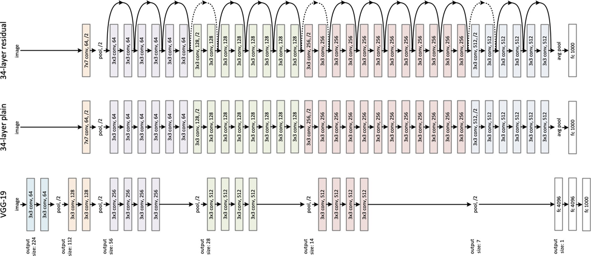
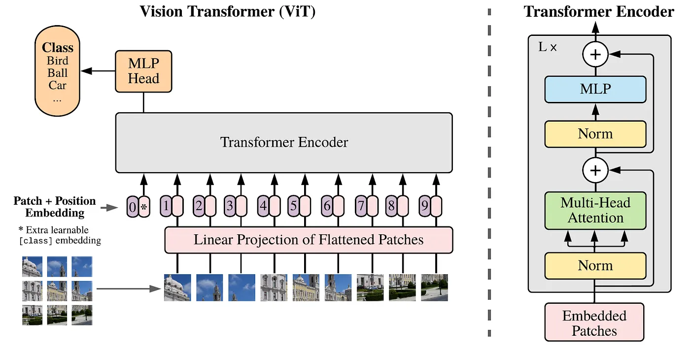

# 2. Transfer Learning for Defect Classification

In this session, we'll leverage pre-trained deep learning models to improve our defect classification performance. Transfer learning is a powerful technique that adapts models trained on large datasets (like ImageNet) to specialized tasks.

```{rubric} Learning Outcomes
```

By the end of this day, you will be able to:

- **Understand** the principles of transfer learning and why it's useful
- **Load and adapt** pre-trained models (MobileNetV2, ResNet50V2, Vision Transformer) for custom tasks
- **Compare** different architectures and their performance on steel defect classification


:::{questions}
- Why is transfer learning useful for image classification?
- How do I adapt a pre-trained model for my specific task?

:::

:::{objectives}
- Load pre-trained models
- Build custom transfer learning architectures on top of base models
- Evaluate and compare multiple models (MobileNetV2, ResNet50V2, Vision Transformer)
:::

```{rubric} Why Transfer Learning?
```

Transfer learning allows us to:

- **Leverage existing knowledge**: Use features learned from ImageNet (1.2M images, 1000 classes)
- **Improve accuracy**: Better performance with limited labeled data
- **Reduce computational cost**: Freeze base model weights, train only custom layers
- **Speed up training**: Converge in 5-10 epochs instead of 50+


## 2.1. Formulate / Outline the Problem

We aim to classify steel surface defects using transfer learning. The challenge is to achieve high accuracy with limited labeled data and minimal training time by leveraging pre-trained models.

## 2.2. Prepare Data

First, let's load the NEU Surface Defect Database:

```python
import os
import numpy as np
import tensorflow as tf
from tensorflow import keras

# Download the NEU Surface Defect Database using kagglehub
import kagglehub
path = kagglehub.dataset_download("kaustubhdikshit/neu-surface-defect-database")

# Define paths for train and validation data
train_path_img = os.path.join(path, "NEU-DET", "train", "images")
validation_path_img = os.path.join(path, "NEU-DET", "validation", "images")

# Get sorted class names for consistency
train_classes = sorted(os.listdir(train_path_img))
class_names = train_classes
print(f"Classes found: {class_names}")

# Load training and validation datasets
BATCH_SIZE = 32
IMAGE_SIZE = 255

train_dataset = keras.preprocessing.image_dataset_from_directory(
    directory=train_path_img,
    labels='inferred',
    label_mode='categorical',
    batch_size=BATCH_SIZE,
    image_size=(IMAGE_SIZE, IMAGE_SIZE),
    class_names=class_names,
    shuffle=True,
    seed=100
)

val_dataset = keras.preprocessing.image_dataset_from_directory(
    directory=validation_path_img,
    labels='inferred',
    label_mode='categorical',
    batch_size=BATCH_SIZE,
    image_size=(IMAGE_SIZE, IMAGE_SIZE),
    class_names=class_names,
    shuffle=True,
    seed=100
)

print(f"Training dataset: {train_dataset}")
print(f"Validation dataset: {val_dataset}")
```

## 2.3. Choose a Pretrained Model

### 2.3.1. MobileNetV2

```python
import tensorflow as tf
from tensorflow import keras

# Load pre-trained MobileNetV2 base model
base_model = tf.keras.applications.MobileNetV2(
    input_shape=(224, 224, 3),
    include_top=False,  # Remove the top classification layers
    weights='imagenet'   # Pre-trained on ImageNet
)

# Freeze base model weights - we won't update these during training
base_model.trainable = False

print(f"Base model loaded with {base_model.count_params():,} parameters")
print(f"Frozen layers: {len(base_model.layers)}")
```

**Key points:**
- `include_top=False`: Remove classification head, keep feature extraction layers
- `weights='imagenet'`: Load weights pre-trained on ImageNet
- `base_model.trainable = False`: Freeze weights to preserve learned features

**Building Custom Head**

```python
# Build Transfer Learning Model
def build_transfer_learning_model():
    """Build MobileNetV2 transfer learning model for defect classification"""
    
    # Input layer - expects 255x255x3 images
    inputs = tf.keras.Input(shape=(IMAGE_SIZE, IMAGE_SIZE, 3))
    
    # Resize to MobileNetV2 input size (224x224)
    x = keras.layers.Resizing(224, 224)(inputs)
    
    # Apply MobileNetV2 preprocessing
    x = tf.keras.applications.mobilenet_v2.preprocess_input(x)
    
    # Pass through frozen base model
    x = base_model(x, training=False)
    
    # Global average pooling to reduce spatial dimensions
    x = tf.keras.layers.GlobalAveragePooling2D()(x)
    
    # Add dropout for regularization
    x = tf.keras.layers.Dropout(0.3)(x)
    
    # Fully connected layer
    x = tf.keras.layers.Dense(256, activation="relu")(x)
    
    # Dropout again
    x = tf.keras.layers.Dropout(0.2)(x)
    
    # Output layer - 6 classes for defect types
    outputs = tf.keras.layers.Dense(len(class_names), activation="softmax")(x)
    
    # Create model
    model = tf.keras.Model(inputs=inputs, outputs=outputs)
    
    return model

# Build the model
tl_model = build_transfer_learning_model()

# Compile with appropriate loss for categorical labels
tl_model.compile(
    optimizer=tf.keras.optimizers.Adam(learning_rate=0.001),
    loss='categorical_crossentropy',
    metrics=['accuracy']
)

print("\nTransfer Learning Model Summary:")
tl_model.summary()
```


```{rubric} Choose Loss Function and Optimizer
```

```python
tl_model.compile(
    optimizer=tf.keras.optimizers.Adam(learning_rate=0.001),  # Lower than standard training
    loss='categorical_crossentropy',
    metrics=['accuracy']
)

```

```{rubric} Visualizing Predictions
```

```python
# Visualize Predictions on Validation Set
plt.figure(figsize=(18, 10))
for images, labels in val_dataset.take(1):
    predictions = tl_model.predict(images)
    predicted_classes = [np.argmax(pred) for pred in predictions]
    
    for i in range(0, min(15, len(images))):
        ax = plt.subplot(3, 5, i + 1)
        plt.imshow(images[i].numpy().astype("uint8"))
        
        actual_class_idx = np.argmax(labels[i].numpy())
        actual_class = class_names[actual_class_idx]
        predicted_class = class_names[predicted_classes[i]]
        
        # Color title green if correct, red if wrong
        color = 'green' if actual_class_idx == predicted_classes[i] else 'red'
        plt.title(f"P: {predicted_class}\nA: {actual_class}", 
                 color=color, fontweight='bold', fontsize=9)
        plt.axis('off')

plt.tight_layout()
plt.show()
```

```{rubric} Measure Performance
```

```python
import matplotlib.pyplot as plt
import numpy as np

# Plot Training History - Loss and Accuracy
fig, axes = plt.subplots(1, 2, figsize=(14, 5))

# Loss plot
axes[0].plot(np.arange(1, TL_EPOCHS + 1), tl_history.history['loss'], 
             color='black', label='Training Loss', marker='o')
axes[0].plot(np.arange(1, TL_EPOCHS + 1), tl_history.history['val_loss'], 
             color='red', label='Validation Loss', marker='o')
axes[0].set_xlabel('Epoch', fontsize=12)
axes[0].set_ylabel('Loss', fontsize=12)
axes[0].set_title('Training and Validation Loss', fontsize=13, fontweight='bold')
axes[0].legend(fontsize=10)
axes[0].grid(True, alpha=0.3)

# Accuracy plot
axes[1].plot(np.arange(1, TL_EPOCHS + 1), tl_history.history['accuracy'], 
             color='black', label='Training Accuracy', marker='o')
axes[1].plot(np.arange(1, TL_EPOCHS + 1), tl_history.history['val_accuracy'], 
             color='red', label='Validation Accuracy', marker='o')
axes[1].set_xlabel('Epoch', fontsize=12)
axes[1].set_ylabel('Accuracy', fontsize=12)
axes[1].set_title('Training and Validation Accuracy', fontsize=13, fontweight='bold')
axes[1].legend(fontsize=10)
axes[1].grid(True, alpha=0.3)

plt.tight_layout()
plt.show()
```

**Confusion Matrix and Classification Report**

```python
import seaborn as sns
from sklearn.metrics import classification_report

# Compute Confusion Matrix and Classification Report on All Validation Data
print("Computing predictions on entire validation dataset...")
tl_ypred_tot = []
tl_label_tot = []

for images, labels in val_dataset:
    predictions = tl_model.predict(images, verbose=0)
    predicted_classes = [np.argmax(pred) for pred in predictions]
    tl_ypred_tot.extend(predicted_classes)
    tl_label_tot.extend([np.argmax(label.numpy()) for label in labels])

# Create confusion matrix
tl_cm = tf.math.confusion_matrix(tl_label_tot, tl_ypred_tot, num_classes=len(class_names))

# Display confusion matrix as heatmap
plt.figure(figsize=(10, 8))
sns.heatmap(tl_cm, annot=True, cmap="Blues", 
            xticklabels=class_names, yticklabels=class_names, 
            fmt='d', cbar_kws={'label': 'Count'})
plt.xlabel('Predicted Class', fontsize=12, fontweight='bold')
plt.ylabel('Actual Class', fontsize=12, fontweight='bold')
plt.title('Confusion Matrix - Transfer Learning Model (Validation Set)', 
         fontsize=13, fontweight='bold')
plt.tight_layout()
plt.show()

# Print detailed classification report
print("\n" + "="*60)
print("CLASSIFICATION REPORT - TRANSFER LEARNING MODEL")
print("="*60)
print(classification_report(tl_label_tot, tl_ypred_tot, 
                          labels=range(len(class_names)), 
                          target_names=class_names, 
                          digits=4))

# Print accuracy summary
overall_accuracy = np.sum(np.diag(tl_cm)) / np.sum(tl_cm)
print(f"\nOverall Accuracy: {overall_accuracy:.2%}")
print("="*60)
```

### 2.3.2. ResNet50V2 Model

ResNet50V2 is a more powerful architecture with residual connections that enable training of very deep networks.




**Load pre-trained ResNet50V2 model**


```python
# Load pre-trained ResNet50V2 base model
base_model = tf.keras.applications.ResNet50V2(
    input_shape=(200, 200, 3),
    include_top=False,  # Remove classification head
    weights='imagenet'   # Pre-trained weights
)

# Freeze base model weights
base_model.trainable = False

print(f"Base model loaded with {base_model.count_params():,} parameters")
print(f"Frozen layers: {len(base_model.layers)}")
```

**Build Transfer Learning ResNet50V2 Model**

```python
def build_transfer_learning_model_resnet50():
    """Build ResNet50V2 transfer learning model for defect classification"""
    
    inputs = tf.keras.Input(shape=(IMAGE_SIZE, IMAGE_SIZE, 3))
    x = keras.layers.Resizing(200, 200)(inputs)
    
    # Apply ResNet50V2 preprocessing
    x = tf.keras.applications.resnet_v2.preprocess_input(x)
    x = base_model(x, training=False)
    
    # Add custom head
    x = tf.keras.layers.GlobalAveragePooling2D()(x)
    x = tf.keras.layers.Dropout(0.3)(x)
    x = tf.keras.layers.Dense(256, activation="relu")(x)
    x = tf.keras.layers.Dropout(0.2)(x)
    outputs = tf.keras.layers.Dense(len(class_names), activation="softmax")(x)
    
    model = tf.keras.Model(inputs=inputs, outputs=outputs)
    return model

# Build and compile
resnet_model = build_transfer_learning_model_resnet50()

resnet_model.compile(
    optimizer=tf.keras.optimizers.Adam(learning_rate=0.001),
    loss='categorical_crossentropy',
    metrics=['accuracy']
)

print("\nTransfer Learning Model Summary (ResNet50V2):")
resnet_model.summary()
```

**Train Transfer Learning ResNet50V2 model**

```python
RESNET_EPOCHS = 10

print("Training ResNet50V2 Transfer Learning Model...")
resnet_history = resnet_model.fit(
    train_dataset,
    validation_data=val_dataset,
    epochs=RESNET_EPOCHS,
    verbose=1
)

# Save the model
resnet_model.save("resnet50v2_model.h5")
print("\nTraining completed!")
```

```{rubric} Refine the Model
```
**Fine-tuning: Selective Layer Unfreezing**

Fine-tuning improves performance by unfreezing deeper layers of the base model to learn task-specific features.

```python
# Unfreeze the last convolutional block for task-specific learning
base_model.trainable = True

# Keep early layers frozen (they learn generic features)
for layer in base_model.layers[:100]:
    layer.trainable = False

# Recompile with lower learning rate for fine-tuning
resnet_model.compile(
    optimizer=tf.keras.optimizers.Adam(learning_rate=1e-5),  # Much lower learning rate
    loss='categorical_crossentropy',
    metrs=FINETUNE_EPOCHS,
    verbose=1
)

# Save fine-tuned model
resnet_model.save("resnet50v2_finetuned_model.h5")
print("Fine-tuned model saved!")
```


### 2.3.3. Vision Transformer (ViT)

Vision Transformers use self-attention mechanisms instead of convolutions, allowing the model to capture global spatial relationships in images.



#### Vision Transformer architecture

Define a Vision Transformer architecture with patch embeddings and transformer blocks:

```python
# Define Patch Embedding layer for Vision Transformer
class PatchEmbedding(layers.Layer):
    """Convert image into patches and embed them"""
    def __init__(self, patch_size=16, embed_dim=128):
        super(PatchEmbedding, self).__init__()
        self.patch_size = patch_size
        self.embed_dim = embed_dim
        
        # Use Conv2D for efficient patch extraction
        self.projection = layers.Conv2D(
            embed_dim, 
            kernel_size=patch_size, 
            strides=patch_size,
            padding='valid'
        )
        self.flatten = layers.Reshape((-1, embed_dim))

    def call(self, x):
        # Project patches to embedding dimension
        x = self.projection(x)
        # Flatten to (batch_size, num_patches, embed_dim)
        x = self.flatten(x)
        return x

# Define Transformer Block
class TransformerBlock(layers.Layer):
    """Transformer block with multi-head attention and MLP"""
    def __init__(self, embed_dim=128, num_heads=4, mlp_dim=256, dropout_rate=0.1):
        super(TransformerBlock, self).__init__()
        
        # Multi-head attention
        self.attention = layers.MultiHeadAttention(
            num_heads=num_heads, 
            key_dim=embed_dim,
            dropout=dropout_rate
        )
        
        # MLP block
        self.mlp = keras.Sequential([
            layers.Dense(mlp_dim, activation=tf.nn.gelu),
            layers.Dropout(dropout_rate),
            layers.Dense(embed_dim)
        ])
        
        # Layer normalization
        self.layernorm1 = layers.LayerNormalization(epsilon=1e-6)
        self.layernorm2 = layers.LayerNormalization(epsilon=1e-6)
        self.dropout = layers.Dropout(dropout_rate)

    def call(self, x, training=False):
        # Multi-head attention with residual connection
        attn_output = self.attention(x, x, training=training)
        attn_output = self.dropout(attn_output, training=training)
        x = self.layernorm1(x + attn_output)
        
        # MLP with residual connection
        mlp_output = self.mlp(x)
        mlp_output = self.dropout(mlp_output, training=training)
        x = self.layernorm2(x + mlp_output)
        
        return x
```

**Build Vision Transformer Model (from scratch)**

```python
def build_vit_model_scratch():
    """Build Vision Transformer model for image classification (trained from scratch)"""
    
    # Configuration
    PATCH_SIZE = 16
    NUM_PATCHES = (IMAGE_SIZE // PATCH_SIZE) ** 2
    EMBED_DIM = 128
    NUM_HEADS = 4
    MLP_DIM = 256
    NUM_TRANSFORMER_BLOCKS = 4
    
    inputs = tf.keras.Input(shape=(IMAGE_SIZE, IMAGE_SIZE, 3))
    
    # Patch embedding
    x = PatchEmbedding(patch_size=PATCH_SIZE, embed_dim=EMBED_DIM)(inputs)
    
    # Add positional embeddings
    positions = tf.range(NUM_PATCHES)
    pos_encoding = layers.Embedding(NUM_PATCHES, EMBED_DIM)(positions)
    x = x + pos_encoding
    
    # Transformer blocks
    for _ in range(NUM_TRANSFORMER_BLOCKS):
        x = TransformerBlock(
            embed_dim=EMBED_DIM,
            num_heads=NUM_HEADS,
            mlp_dim=MLP_DIM,
            dropout_rate=0.1
        )(x)
    
    # Classification head
    x = layers.GlobalAveragePooling1D()(x)
    x = layers.Dropout(0.2)(x)
    x = layers.Dense(256, activation='relu')(x)
    x = layers.Dropout(0.1)(x)
    outputs = layers.Dense(len(class_names), activation='softmax')(x)
    
    model = keras.Model(inputs=inputs, outputs=outputs)
    return model

# Build and compile
print("Building Vision Transformer Model (from scratch)...")
vit_model_scratch = build_vit_model_scratch()

vit_model_scratch.compile(
    optimizer=tf.keras.optimizers.Adam(learning_rate=0.001),
    loss='categorical_crossentropy',
    metrics=['accuracy']
)

print("\nVision Transformer Model (from scratch) Summary:")
vit_model_scratch.summary()
```

#### Transfer learning with ViT

For production use, leverage pretrained Vision Transformers from `keras_cv`:

```python
# Install keras_cv for pretrained Vision Transformer
import subprocess
import sys

try:
    import keras_cv
except ImportError:
    print("Installing keras_cv...")
    subprocess.check_call([sys.executable, "-m", "pip", "install", "-q", "keras_cv"])
    import keras_cv

# Build Transfer Learning Model with Vision Transformer
def build_vit_transfer_learning_model():
    """Build Vision Transformer transfer learning model for defect classification"""
    
    # Input layer and Resize to ViT input size (224x224)
    inputs = tf.keras.Input(shape=(IMAGE_SIZE, IMAGE_SIZE, 3))
    x = keras.layers.Resizing(224, 224)(inputs)
    
    # Load pretrained ViT model from keras_cv
    # ViT base model trained on ImageNet21k and fine-tuned on ImageNet1k
    base_model = keras_cv.models.ViT(
        include_top=False,
        input_shape=(224, 224, 3),
        weights="imagenet"
    )
    
    # Freeze base model weights
    base_model.trainable = False
    
    # Pass input through base model
    x = base_model(x, training=False)
    
    # Add classification head
    x = keras.layers.GlobalAveragePooling1D()(x)
    x = keras.layers.Dropout(0.3)(x)
    x = keras.layers.Dense(256, activation="relu")(x)
    x = keras.layers.Dropout(0.2)(x)
    outputs = keras.layers.Dense(len(class_names), activation="softmax")(x)
    
    model = keras.Model(inputs=inputs, outputs=outputs)
    return model, base_model

# Build and compile
print("Building Vision Transformer Transfer Learning Model...")
vit_model_transfer, vit_base_model = build_vit_transfer_learning_model()

vit_model_transfer.compile(
    optimizer=tf.keras.optimizers.Adam(learning_rate=0.001),
    loss='categorical_crossentropy',
    metrics=['accuracy']
)

print("\nVision Transformer Transfer Learning Model Summary:")
vit_model_transfer.summary()
```

**Train Transformer learning ViT**

```python
VIT_EPOCHS = 10

# Train Vision Transformer (from scratch)
print("="*60)
print("Training Vision Transformer Model (FROM SCRATCH)...")
print("="*60)
vit_history_scratch = vit_model_scratch.fit(
    train_dataset,
    validation_data=val_dataset,
    epochs=VIT_EPOCHS,
    verbose=1
)

# Save the model
vit_model_scratch.save("vit_model_scratch.h5")

# Train Vision Transformer (Transfer Learning)
print("\n" + "="*60)
print("Training Vision Transformer Model (TRANSFER LEARNING)...")
print("="*60)
vit_history_transfer = vit_model_transfer.fit(
    train_dataset,
    validation_data=val_dataset,
    epochs=VIT_EPOCHS,
    verbose=1
)

# Save fine-tuned model
vit_model_transfer.save("vit_model_transfer.h5")
print("\nTraining completed!")
```

**Visualize Training Performance**

```python
# Plot Vision Transformer Training History (FROM SCRATCH)
fig, axes = plt.subplots(1, 2, figsize=(14, 5))

# Loss plot
axes[0].plot(np.arange(1, VIT_EPOCHS + 1), vit_history_scratch.history['loss'], 
             color='black', label='Training Loss', marker='o')
axes[0].plot(np.arange(1, VIT_EPOCHS + 1), vit_history_scratch.history['val_loss'],
             color='red', label='Validation Loss', marker='o')
axes[0].set_xlabel('Epoch', fontsize=12)
axes[0].set_ylabel('Loss', fontsize=12)
axes[0].set_title('Vision Transformer (From Scratch) - Training and Validation Loss', fontsize=13, fontweight='bold')
axes[0].legend(fontsize=10)
axes[0].grid(True, alpha=0.3)

# Accuracy plot
axes[1].plot(np.arange(1, VIT_EPOCHS + 1), vit_history_scratch.history['accuracy'],
             color='black', label='Training Accuracy', marker='o')
axes[1].plot(np.arange(1, VIT_EPOCHS + 1), vit_history_scratch.history['val_accuracy'],
             color='red', label='Validation Accuracy', marker='o')
axes[1].set_xlabel('Epoch', fontsize=12)
axes[1].set_ylabel('Accuracy', fontsize=12)
axes[1].set_title('Vision Transformer (From Scratch) - Training and Validation Accuracy', fontsize=13, fontweight='bold')
axes[1].legend(fontsize=10)
axes[1].grid(True, alpha=0.3)

plt.tight_layout()
plt.show()

# Plot Vision Transformer Training History (TRANSFER LEARNING)
fig, axes = plt.subplots(1, 2, figsize=(14, 5))

# Loss plot
axes[0].plot(np.arange(1, VIT_EPOCHS + 1), vit_history_transfer.history['loss'],
             color='black', label='Training Loss', marker='o')
axes[0].plot(np.arange(1, VIT_EPOCHS + 1), vit_history_transfer.history['val_loss'],
             color='red', label='Validation Loss', marker='o')
axes[0].set_xlabel('Epoch', fontsize=12)
axes[0].set_ylabel('Loss', fontsize=12)
axes[0].set_title('Vision Transformer (Transfer Learning) - Training and Validation Loss', fontsize=13, fontweight='bold')
axes[0].legend(fontsize=10)
axes[0].grid(True, alpha=0.3)

# Accuracy plot
axes[1].plot(np.arange(1, VIT_EPOCHS + 1), vit_history_transfer.history['accuracy'],
             color='black', label='Training Accuracy', marker='o')
axes[1].plot(np.arange(1, VIT_EPOCHS + 1), vit_history_transfer.history['val_accuracy'],
             color='red', label='Validation Accuracy', marker='o')
axes[1].set_xlabel('Epoch', fontsize=12)
axes[1].set_ylabel('Accuracy', fontsize=12)
axes[1].set_title('Vision Transformer (Transfer Learning) - Training and Validation Accuracy', fontsize=13, fontweight='bold')
axes[1].legend(fontsize=10)
axes[1].grid(True, alpha=0.3)

plt.tight_layout()
plt.show()
```

**Perform Predictions**

```python
# Visualize Vision Transformer Predictions on Validation Set
plt.figure(figsize=(18, 10))
for images, labels in val_dataset.take(1):
    # Use transfer learning model for predictions
    predictions = vit_model_transfer.predict(images)
    predicted_classes = [np.argmax(pred) for pred in predictions]
    
    for i in range(0, min(15, len(images))):
        ax = plt.subplot(3, 5, i + 1)
        plt.imshow(images[i].numpy().astype("uint8"))
        
        actual_class_idx = np.argmax(labels[i].numpy())
        actual_class = class_names[actual_class_idx]
        predicted_class = class_names[predicted_classes[i]]
        
        # Color title green if correct, red if wrong
        color = 'green' if actual_class_idx == predicted_classes[i] else 'red'
        plt.title(f"P: {predicted_class}\nA: {actual_class}", 
                 color=color, fontweight='bold', fontsize=14)
        plt.axis('off')

plt.tight_layout()
plt.show()

# Compute Confusion Matrix and Classification Report for Vision Transformer
print("Computing predictions on entire validation dataset...")
vit_ypred_tot = []
vit_label_tot = []

for images, labels in val_dataset:
    predictions = vit_model_transfer.predict(images, verbose=0)
    predicted_classes = [np.argmax(pred) for pred in predictions]
    vit_ypred_tot.extend(predicted_classes)
    vit_label_tot.extend([np.argmax(label.numpy()) for label in labels])

# Create confusion matrix
vit_cm = tf.math.confusion_matrix(vit_label_tot, vit_ypred_tot, num_classes=len(class_names))

# Display confusion matrix as heatmap
plt.figure(figsize=(10, 8))
sns.heatmap(vit_cm, annot=True, cmap="Blues", 
            xticklabels=class_names, yticklabels=class_names, 
            fmt='d', cbar_kws={'label': 'Count'})
plt.xlabel('Predicted Class', fontsize=12, fontweight='bold')
plt.ylabel('Actual Class', fontsize=12, fontweight='bold')
plt.title('Confusion Matrix - Vision Transformer (Validation Set)', 
         fontsize=13, fontweight='bold')
plt.tight_layout()
plt.show()

# Print detailed classification report
print("\n" + "="*60)
print("CLASSIFICATION REPORT - VISION TRANSFORMER MODEL")
print("="*60)
print(classification_report(vit_label_tot, vit_ypred_tot, 
                          labels=range(len(class_names)), 
                          target_names=class_names, 
                          digits=4))

# Print accuracy summary
overall_accuracy = np.sum(np.diag(vit_cm)) / np.sum(vit_cm)
print(f"\nOverall Accuracy: {overall_accuracy:.4f}")
```


```{rubric} Summary
```

Transfer learning & modern architectures provide powerful techniques:
- ✓ **MobileNetV2**: Lightweight, ~5 epochs to convergence
- ✓ **ResNet50V2**: Powerful CNN, ~92-94% accuracy on defect classification
- ✓ **Vision Transformer**: ....


:::{exercise} Exercise 1: Compare All Models
1. Train MobileNetV2, ResNet50V2, and Vision Transformer on steel defects
2. Create a comparison table with:
   - Final validation accuracy
   - Training time (in minutes)
   - Model size (MB)
   - Inference speed (images/second)
3. Which model would you recommend for production? Why?
:::

:::{exercise} Exercise 2: Fine-tuning Strategies
1. Train ResNet50V2 with frozen base (5 epochs)
2. Unfreeze last 10 layers, fine-tune with lr=1e-5 (5 epochs)
3. Unfreeze last 20 layers, fine-tune with lr=1e-6 (5 epochs)
4. Plot the accuracy progression
5. At what point does additional fine-tuning stop helping?
:::


:::{exercise} Exercise 2: Custom Architecture Design
1. Design a hybrid model combining CNN (ResNet blocks) + Attention mechanisms
2. Compare against pure CNN and pure Transformer
3. Can you achieve better accuracy with fewer parameters?
:::

:::{keypoints}
- Transfer learning accelerates learning and improves accuracy dramatically
- MobileNetV2 is efficient for mobile deployment
- ResNet50V2 offers best CNN performance
- Vision Transformers provide state-of-the-art accuracy when data is abundant
- Architecture choice depends on accuracy vs. deployment constraints
- Compare multiple models before selecting for production
:::
